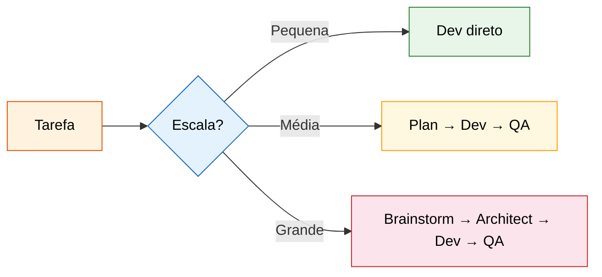
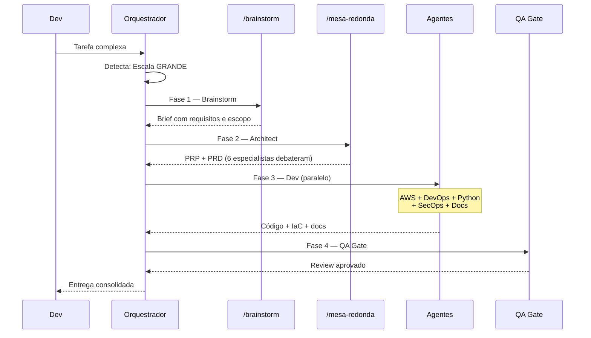
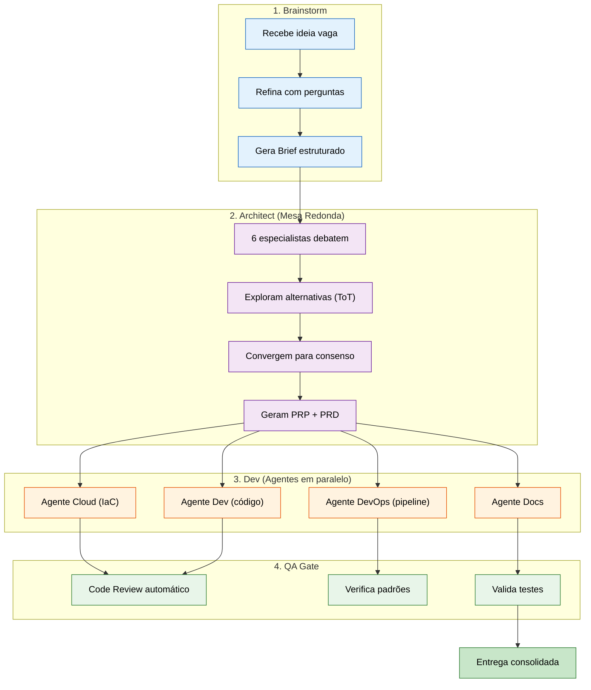

# BMAD na Prática — Guia de Exemplos

<div align="center">

```
  ╔══════════════════════════════════════════════════════════════╗
  ║                                                              ║
  ║   BMAD = Breakthrough Method for Agile AI-Driven Development ║
  ║   O pipeline que adapta a profundidade ao tamanho do problema ║
  ║                                                              ║
  ╚══════════════════════════════════════════════════════════════╝
```

</div>

---

## Como o BMAD funciona

O orquestrador detecta automaticamente a **escala** da tarefa e ativa as fases necessárias:



| Escala | Quando | Fases | Tempo |
|--------|--------|-------|-------|
| **Pequena** | Bug fix, config, pergunta | Dev direto | Minutos |
| **Média** | Feature simples, refactor | Plan → Dev → QA | Minutos a horas |
| **Grande** | Novo sistema, arquitetura complexa | Brainstorm → Architect → Dev → QA | Horas |

---

## Exemplos por Escala

### Escala Pequena — Dev direto

Tarefas simples que não precisam de planejamento.

#### Exemplo 1: Bug fix

```bash
/orquestrador o endpoint /api/users retorna 500 quando o email tem caractere especial
```

**O que acontece:**
1. Orquestrador detecta: **escala pequena** (bug, domínio único)
2. Pula brainstorm e planning
3. Delega direto ao agente de desenvolvimento
4. Agente investiga, corrige, entrega

```
Escala BMAD: Pequena
Fases: Dev direto
Agentes: Explore + Python Developer
```

#### Exemplo 2: Config change

```bash
/orquestrador adicionar variável REDIS_TTL no configmap do namespace payment
```

```
Escala BMAD: Pequena
Fases: Dev direto
Agentes: K8s
```

#### Exemplo 3: Troubleshooting

```bash
/orquestrador pods em CrashLoopBackOff no namespace ingestion
```

```
Escala BMAD: Pequena
Fases: Dev direto
Agentes: K8s + Observability (paralelo)
```

---

### Escala Média — Plan → Dev → QA

Features que precisam de planejamento mas não de debate arquitetural.

#### Exemplo 4: Nova feature em sistema existente

```bash
/orquestrador adicionar export CSV na página de relatórios do dashboard
```

**O que acontece:**
1. Orquestrador detecta: **escala média** (feature simples, 1-2 domínios)
2. **Plan**: gera plano rápido (backend endpoint + frontend botão + testes)
3. **Dev**: delega implementação aos agentes
4. **QA Gate**: revisa código antes de entregar

```
Escala BMAD: Média
Fases: Plan → Dev → QA
Agentes: FastAPI + Frontend Design + Tester
```

#### Exemplo 5: Refactor com impacto

```bash
/orquestrador migrar autenticação de session-based para JWT em toda a API
```

```
Escala BMAD: Média
Fases: Plan → Dev → QA
Agentes: Plan → SecOps + Python Developer + Tester
```

#### Exemplo 6: Pipeline CI/CD

```bash
/orquestrador criar pipeline de deploy para o serviço de notificações no AKS
```

```
Escala BMAD: Média
Fases: Plan → Dev → QA
Agentes: Plan → DevOps + AKS + SecOps
```

---

### Escala Grande — Brainstorm → Architect → Dev → QA

Projetos complexos que exigem ideação, debate e planejamento profundo.

#### Exemplo 7: Novo sistema do zero

```bash
/orquestrador criar sistema de backup granular para bases RDS com upload S3,
suporte multi-engine, credenciais via Secrets Manager, pipeline CI/CD no
Azure DevOps, processo documentado de restore
```

**O que acontece:**



```
Escala BMAD: Grande
Fases: Brainstorm → Architect (Mesa Redonda) → Dev → QA
Agentes: AWS + DevOps + Python + SecOps + Documentation
Artefatos: Brief + PRP + PRD + Código + Docs
```

#### Exemplo 8: Decisão de arquitetura

```bash
/orquestrador precisamos decidir: manter monolito ou migrar para microsserviços?
o sistema tem 50k usuários e está crescendo 20% ao mês
```

**O que acontece:**
1. **Brainstorm**: refina o contexto (quais serviços, onde dói, restrições)
2. **Architect (Mesa Redonda)**: 6 especialistas debatem prós/contras
3. Gera **PRP** (técnico) + **PRD** (produto) com a decisão
4. Não vai para Dev (é decisão, não implementação)

```
Escala BMAD: Grande
Fases: Brainstorm → Architect
Agentes: Mesa Redonda (6 especialistas)
Artefatos: Brief + PRP + PRD
```

#### Exemplo 9: Plataforma de dados

```bash
/orquestrador construir plataforma de analytics com ingestão de 3 fontes
(API REST, banco PostgreSQL, arquivos S3), transformação com dbt,
orquestração com Airflow e visualização no Superset
```

```
Escala BMAD: Grande
Fases: Brainstorm → Architect → Dev → QA
Agentes: Airflow + dbt + PostgreSQL + AWS + DevOps + Tester
Artefatos: Brief + PRP + PRD + DAGs + Models + IaC
```

#### Exemplo 10: Migração multi-cloud

```bash
/orquestrador migrar workloads do EKS para GKE mantendo zero downtime,
com estratégia blue-green e rollback automático
```

```
Escala BMAD: Grande
Fases: Brainstorm → Architect → Dev → QA
Agentes: EKS + GKE + Networking + DevOps + SecOps
Artefatos: Brief + PRP + PRD + Manifests + Pipeline + Runbook
```

---

## Usando as Skills Diretamente

Você também pode chamar cada fase do BMAD individualmente:

### /brainstorm — Ideação

```bash
/brainstorm quero criar um chatbot interno que responda perguntas sobre
nossa documentação técnica usando RAG
```

**Output:** Brief estruturado com objetivo, escopo, requisitos, restrições e user stories.

### /mesa-redonda — Debate Arquitetural

```bash
/mesa-redonda devemos usar Redis ou Memcached para cache da API?
Temos 10k req/s, dados de 1-50KB, TTL de 5 minutos
```

**Output:** Debate entre 6 especialistas + PRP (técnico) + PRD (produto).

### /orquestrador — Pipeline Completo

```bash
/orquestrador [qualquer tarefa]
```

**Output:** Detecta escala automaticamente e executa o pipeline BMAD adequado.

---

## Fluxo Completo de um Projeto Grande



---

## Resumo

```
  ┌─────────────────────────────────────────────────────────────┐
  │                                                             │
  │  BMAD = a IA faz o trabalho certo, na profundidade certa   │
  │                                                             │
  │  Bug simples?     → Resolve em 2 min, sem burocracia       │
  │  Feature média?   → Planeja rápido, implementa, revisa     │
  │  Sistema complexo? → Brainstorm → Debate → Implementa → QA │
  │                                                             │
  │  Tudo automático. O orquestrador decide o caminho.          │
  │                                                             │
  └─────────────────────────────────────────────────────────────┘
```
