# 🚀 Desenvolvimento com IA: Como Extrair o Máximo

<div align="center">

```
  ╔══════════════════════════════════════════════════════════════╗
  ║                                                              ║
  ║   🧠  IA não substitui o dev — ela MULTIPLICA o dev  🧠       ║
  ║                                                              ║
  ╚══════════════════════════════════════════════════════════════╝
```

**Da pergunta pontual ao par de programação autônomo.**
**O caminho que transforma como você entrega software.**

</div>

---

## 🎯 A Oportunidade

Todo mundo aqui já usa IA no dia a dia. Isso é ótimo. Estamos no caminho certo.

Mas tem uma pergunta que vale a pena a gente se fazer de vez em quando:

<div align="center">

> ### 💭 *"Eu estou usando IA da melhor maneira?"*

</div>

Não existe resposta errada. É só um convite para pensar se dá pra ir além.

---

## 📊 Níveis de Uso de IA

Todo dev passa por uma jornada natural. Veja em qual você se identifica hoje:

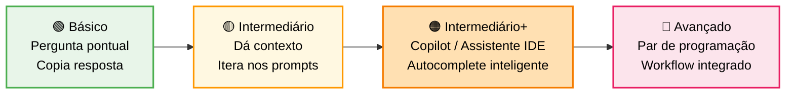

| Nível | 🔧 Como usa | 📈 Resultado |
|:---:|---|---|
| 🟢 **Básico** | Pergunta coisas pontuais, copia resposta | Ganha tempo em tarefas simples |
| 🟡 **Intermediário** | Dá contexto, itera nos prompts, questiona respostas | Entrega com mais qualidade e velocidade |
| 🟠 **Intermediário+** | Usa Copilot/assistente na IDE, autocomplete inteligente, sugestões inline | Acelera escrita de código com contexto local |
| 🔴 **Avançado** | Usa IA como par de programação, integra no workflow inteiro | **Multiplica capacidade** e aprende constantemente |

> 💡 **Nenhum nível é ruim.** Mas o salto entre cada nível é **enorme** em produtividade e aprendizado.

---

## 🧰 Dicas para Extrair Mais da IA

```
  ┌─────────────────────────────────────────────────┐
  │  5 práticas que separam uso básico do avançado  │
  └─────────────────────────────────────────────────┘
```

### 1️⃣ Dar contexto rico

```diff
- ❌ "crie um endpoint"
+ ✅ "preciso de um endpoint de autenticação JWT seguindo o padrão
+     que já temos no projeto, com refresh token e rate limiting"
```

### 2️⃣ Pedir alternativas

> *"Me mostre 2-3 abordagens diferentes com prós e contras de cada uma."*
> Isso expande nosso repertório e evita soluções enviesadas.

### 3️⃣ Explorar áreas novas

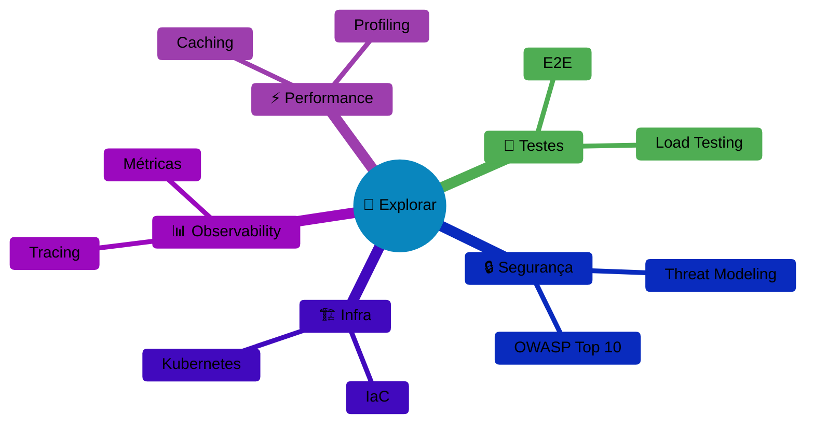

Use a IA para entrar em territórios que levariam **semanas** sozinho.

### 4️⃣ Iterar

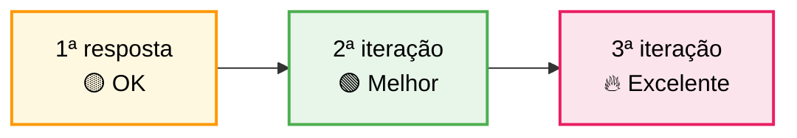

A primeira resposta **raramente é a melhor**. Refine, ajuste, peça melhorias.

### 5️⃣ Revisar e entender

> 🧠 Quanto mais você entende o que a IA gera, mais **aprende** e mais **confiança** tem no resultado.

---

## ⚔️ Por que Padronizar em Claude Code

<div align="center">

```
  ┌──────────────────────────────────────────────┐
  │                                              │
  │   🎯  Uma stack. Um ecossistema. Um time.  🎯 │
  │                                              │
  └──────────────────────────────────────────────┘
```

</div>

### 🔴 O Problema: Cada Um Usa Uma Coisa

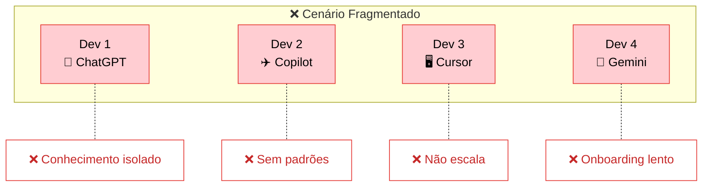

É como se cada dev usasse uma IDE diferente, um OS diferente, um git flow diferente. Funciona, mas a **sinergia do time se perde**.

### 🟢 O que Ganhamos com Stack Única

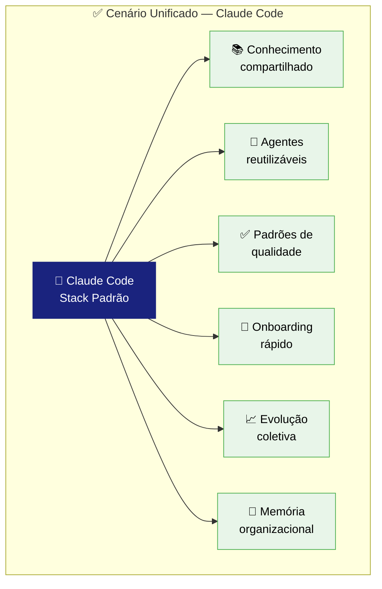

| 🏆 Benefício | 💡 Na prática |
|:---|:---|
| 📚 **Conhecimento compartilhado** | Um dev descobre um prompt incrível, todo mundo usa |
| 🔄 **Agentes reutilizáveis** | Criamos uma vez, todo o time se beneficia |
| ✅ **Padrões de qualidade** | Checklists, anti-patterns e boas práticas embutidos |
| 🚀 **Onboarding rápido** | Dev novo entra e já tem **56 especialistas** prontos |
| 📈 **Evolução coletiva** | O time inteiro evolui junto, não cada um pro seu lado |
| 🧠 **Memória organizacional** | Aprendizados ficam salvos nos agentes, não se perdem |

---

## 🏆 Por que Claude Code Especificamente

> Não é sobre ser "a melhor IA" (todas evoluem rápido).
> É sobre o que ele permite **como plataforma de trabalho**.

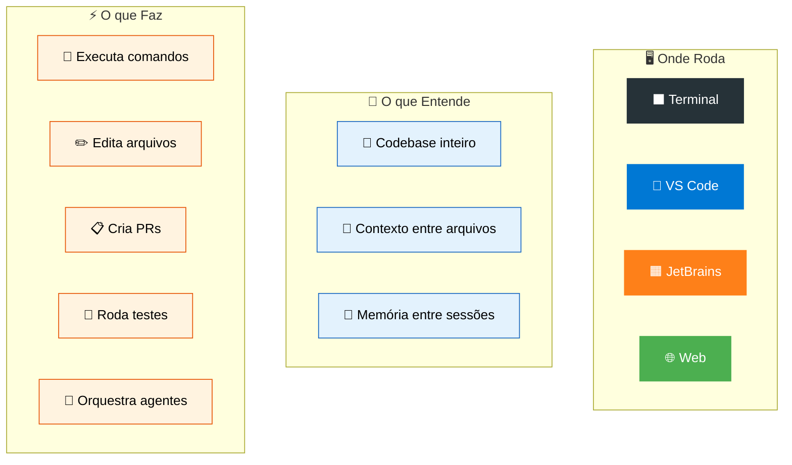

### 🔑 Diferenciais-Chave

| Feature | ChatGPT | Copilot | Cursor | **Claude Code** |
|:---|:---:|:---:|:---:|:---:|
| Entende codebase inteiro | ❌ | ⚠️ | ✅ | ✅ |
| Executa comandos | ❌ | ❌ | ✅ | ✅ |
| Agentes customizáveis | ❌ | ❌ | ❌ | ✅ |
| Orquestração multi-agente | ❌ | ❌ | ❌ | ✅ |
| Memória persistente | ❌ | ❌ | ⚠️ | ✅ |
| Terminal + IDE + Web | ❌ | ⚠️ | ❌ | ✅ |
| Skills/Slash commands | ❌ | ❌ | ❌ | ✅ |

---

## 🔌 MCP: O Superpoder que Acelera Tudo

<div align="center">

```
  ┌──────────────────────────────────────────────────────────┐
  │                                                          │
  │  🔌  MCP = Model Context Protocol                        │
  │  Conecta a IA diretamente às fontes de conhecimento      │
  │                                                          │
  └──────────────────────────────────────────────────────────┘
```

</div>

O **MCP (Model Context Protocol)** é um protocolo aberto que permite conectar servidores de contexto ao Claude Code. Na prática, isso significa que a IA consegue **buscar documentação atualizada, navegar código e entender projetos inteiros** sem que você precise copiar e colar nada.

### 🧩 Como Funciona

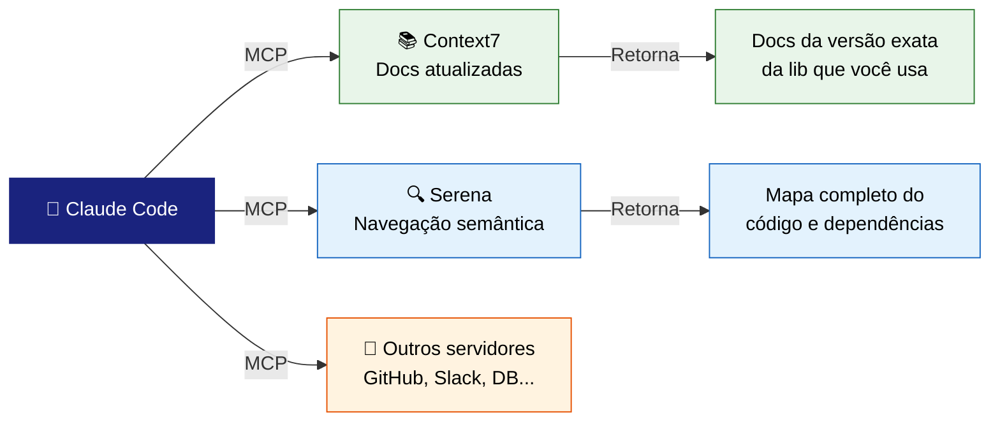

### 📚 Context7 — Documentação Sempre Atualizada

O problema clássico: a IA foi treinada até uma data X, mas a lib que você usa lançou uma versão nova semana passada. O **Context7** resolve isso.

```
  ┌─────────────────────────────────────────────────────────────┐
  │                                                             │
  │  ❌ Sem Context7:                                           │
  │  "Como usar a nova API do Next.js 15?"                      │
  │  → IA responde com a API do Next.js 13 (desatualizada)      │
  │                                                             │
  │  ✅ Com Context7:                                            │
  │  "Como usar a nova API do Next.js 15?"                      │
  │  → IA busca a doc oficial v15 em tempo real e responde      │
  │    com a sintaxe correta e exemplos atualizados             │
  │                                                             │
  └─────────────────────────────────────────────────────────────┘
```

| Benefício | Impacto |
|:---|:---|
| 📖 **Docs em tempo real** | Sempre a versão correta da lib que você está usando |
| 🚫 **Zero alucinação de API** | Não inventa métodos ou parâmetros que não existem |
| ⚡ **Sem alt-tab** | Não precisa abrir a documentação no browser |
| 🔄 **Atualização automática** | Quando a lib atualiza, o Context7 já sabe |

### 🔍 Serena — Navegação Inteligente no Código

O **Serena** dá ao Claude Code uma compreensão **semântica profunda** do seu codebase. Não é só busca por texto — é entendimento real de estrutura, tipos, dependências e relações entre componentes.

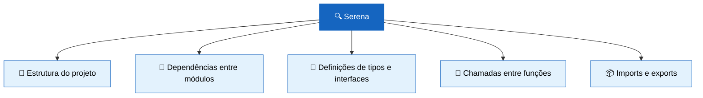

| Benefício | Impacto |
|:---|:---|
| 🧠 **Entendimento profundo** | Sabe como as peças do código se conectam |
| 🎯 **Refactoring preciso** | Muda uma interface e sabe tudo que é afetado |
| 🔍 **Navegação semântica** | Encontra por significado, não só por nome |
| 📐 **Análise de impacto** | Antes de mudar, mostra o que vai quebrar |

### 🚀 O Ganho na Prática

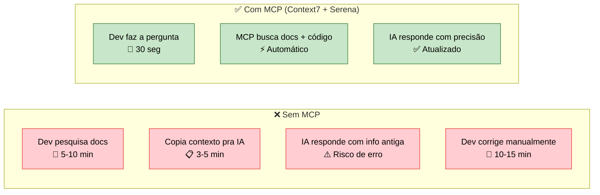

```
  ┌──────────────────────────────────────────────────────────┐
  │                                                          │
  │  ⏱️  Sem MCP: pesquisar docs + copiar contexto + corrigir │
  │  ⚡ Com MCP: perguntar e receber resposta precisa         │
  │  📈 Resultado: ciclos de dev significativamente mais      │
  │     rápidos com menos erros e retrabalho                  │
  │                                                          │
  └──────────────────────────────────────────────────────────┘
```

> 💡 **MCP é extensível.** Além de Context7 e Serena, existem servidores MCP para GitHub, Slack, bancos de dados, APIs internas e muito mais. O ecossistema cresce a cada semana.

---

## 🏗️ O que Já Construímos

<div align="center">

```
  ╔══════════════════════════════════════════════════════════╗
  ║                                                          ║
  ║   Isso tudo JÁ EXISTE e JÁ FUNCIONA. Só precisa usar.    ║
  ║                                                          ║
  ╚══════════════════════════════════════════════════════════╝
```

</div>

```mermaid
graph TB
    subgraph "🎯 Sistema Multi-Agente"
        O["🎭 Orquestrador<br/>Delega tarefas complexas"]
        MR["🗣️ Mesa Redonda<br/>6 especialistas debatem"]
        
        subgraph "☁️ Cloud & Infra (14)"
            C1["Azure"] 
            C2["AWS"]
            C3["GCP"]
            C4["OCI"]
            C5["K8s"]
            C6["AKS/EKS/GKE/OKE"]
            C7["Networking"]
            C8["pfSense"]
            C9["Proxmox"]
        end
        
        subgraph "💻 Desenvolvimento (7)"
            D1["Python"]
            D2["Node.js"]
            D3["FastAPI"]
            D4["Mobile"]
            D5["Frontend Design"]
            D6["Backend Design"]
            D7["Code Review"]
        end
        
        subgraph "📊 Data Engineering (6)"
            DE1["Airflow"]
            DE2["Airbyte"]
            DE3["Spark/Lakehouse"]
            DE4["dbt"]
            DE5["DuckDB"]
            DE6["Databricks"]
        end
        
        subgraph "🔐 Ops & Security (6)"
            S1["DevOps"]
            S2["GitHub"]
            S3["SecOps"]
            S4["Observability"]
            S5["FinOps"]
            S6["Tester"]
        end
        
        subgraph "🏢 Microsoft & Business (6)"
            M1["Office 365"]
            M2["Power Automate"]
            M3["Copilot"]
            M4["Business Pricing"]
            M5["Brand Designer"]
            M6["Documentation"]
        end
        
        subgraph "🧪 DB Specialists (5)"
            DB1["PostgreSQL"]
            DB2["SQL Server"]
            DB3["Redis"]
            DB4["MongoDB"]
            DB5["RDS"]
        end
        
        subgraph "🤖 AI & Innovation (2)"
            AI1["Vision AI"]
            AI2["Research"]
        end
    end
    
    O --> C1
    O --> D1
    O --> DE1
    O --> S1
    O --> M1
    O --> DB1
    O --> AI1
    
    style O fill:#6a1b9a,stroke:#6a1b9a,color:#fff
    style MR fill:#1565c0,stroke:#1565c0,color:#fff
```

### 📦 Resumo do Arsenal

```
  ┌───────────────────────────────────────────────────────┐
  │                                                       │
  │  🤖 56 Agentes Especializados                         │
  │  🎭 1 Orquestrador Multi-Agente                       │
  │  🗣️ 1 Mesa Redonda Técnica (6 especialistas)          │
  │  📄 Templates de documentação, RCA, incidents         │
  │  🔒 Padrões de segurança embutidos                    │
  │  🧠 Aprendizado persistente entre sessões             │
  │                                                       │
  └───────────────────────────────────────────────────────┘
```

---

## 💡 Exemplos Práticos

### 🔥 Cenário 1: Bug em produção

```bash
/k8s meus pods estão em CrashLoopBackOff no namespace payment
```

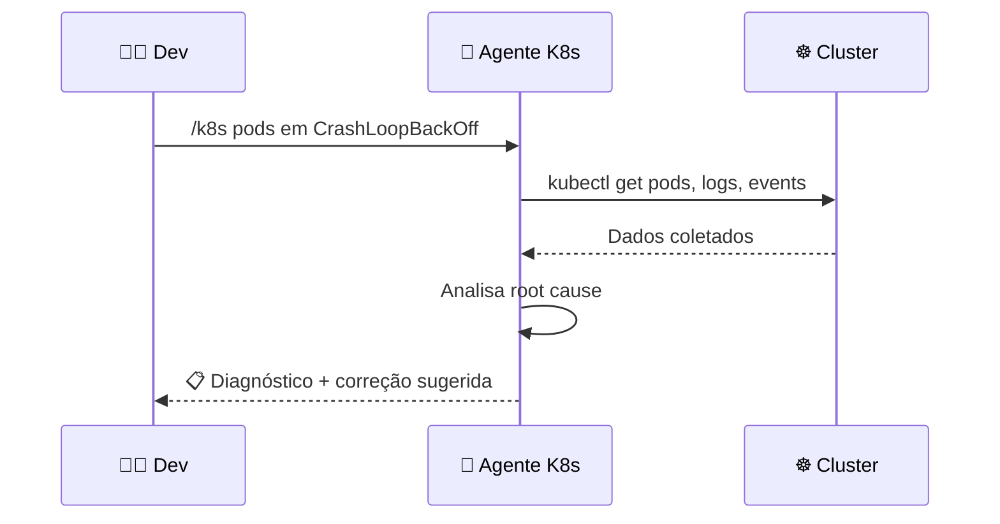

> O agente já sabe investigar **logs, events, resource limits, probes**. Não precisa lembrar os comandos kubectl.

### ⚡ Cenário 2: Feature nova complexa

```bash
/orquestrador criar API de notificações com webhook, deploy no AKS e monitoramento
```

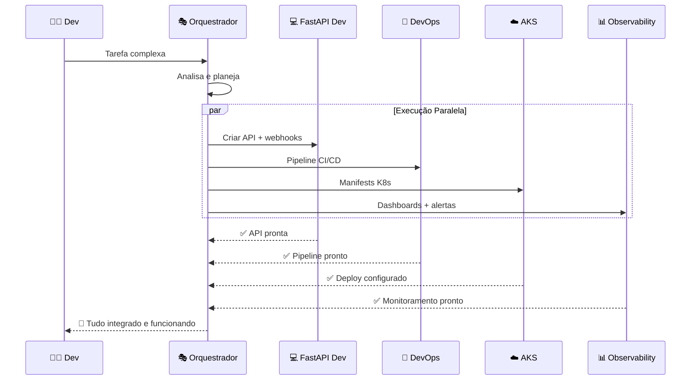

> **4 especialistas em paralelo.** O que levaria dias, sai em minutos.

### 🗣️ Cenário 3: Decisão de arquitetura

```bash
/mesa-redonda devo usar event-driven ou REST síncrono para comunicação entre os microsserviços?
```

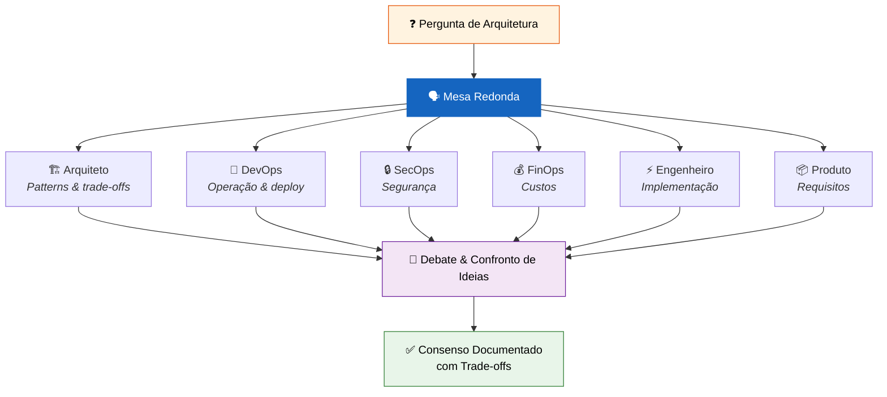

> 6 especialistas debatem entre si e chegam a um **consenso documentado**.

### 🔍 Cenário 4: Code review inteligente

```bash
/code-reviewer revisar este PR com foco em segurança e performance
```

```
  ┌─────────────────────────────────────────────────────────┐
  │  📋 O agente verifica automaticamente:                  │
  │                                                         │
  │  ✅ OWASP Top 10 (SQL injection, XSS, CSRF...)          │
  │  ✅ Performance (N+1 queries, memory leaks, caching)    │
  │  ✅ Padrões do projeto (naming, structure, patterns)    │
  │  ✅ Testes (cobertura, edge cases, happy path)          │
  │  ✅ Segurança (secrets, auth, input validation)         │
  │  ✅ Clean Code (complexidade, duplicação, SOLID)        │
  └─────────────────────────────────────────────────────────┘
```

---

## 📊 Antes vs Depois

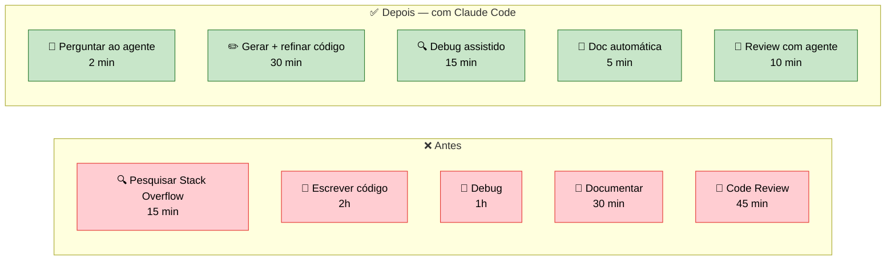

```
  ┌──────────────────────────────────────┐
  │                                      │
  │   ⏱️  Antes: ~4h 30min               │
  │   ⚡ Depois: ~1h 02min                │
  │   📈 Ganho: ~77% mais rápido         │
  │                                      │
  └──────────────────────────────────────┘
```

---

## 🗺️ Jornada de Adoção

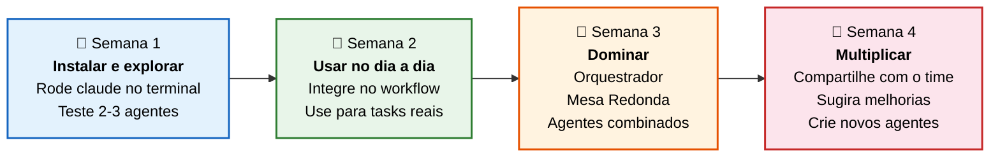

---

## 🎬 O Convite

<div align="center">

```
  ╔══════════════════════════════════════════════════════════════════╗
  ║                                                                  ║
  ║   🚀  Não é sobre trocar de ferramenta.                          ║
  ║       É sobre ter um ECOSSISTEMA que evolui com o time.          ║
  ║                                                                  ║
  ╚══════════════════════════════════════════════════════════════════╝
```

</div>

### O que pedimos:

| # | 🎯 Ação | ⏱️ Tempo |
|:---:|:---|:---:|
| 1️⃣ | **Experimente** o Claude Code e os agentes por uma semana | 5 min/dia |
| 2️⃣ | **Compartilhe** — Descobriu algo útil? Conta pra gente | 2 min |
| 3️⃣ | **Sugira melhorias** — Os agentes evoluem com o uso | Quando quiser |
| 4️⃣ | **Se pergunte toda semana:** *"Estou usando IA da melhor maneira?"* | 10 seg |

---

## 🏁 Começando Agora

```bash
# 1️⃣ Instalar Claude Code
npm install -g @anthropic-ai/claude-code

# 2️⃣ Entrar no projeto e iniciar
cd seu-projeto
claude

# 3️⃣ Testar um agente simples
/devops criar pipeline de CI/CD com lint, test e deploy

# 4️⃣ Testar algo mais poderoso
/orquestrador criar API REST com deploy no K8s e monitoramento

# 5️⃣ Testar a Mesa Redonda
/mesa-redonda qual a melhor stack para nosso próximo projeto?
```

---

## ❓ FAQ

<details>
<summary><b>🤔 Preciso pagar algo?</b></summary>

O Claude Code requer uma assinatura Claude Pro/Team ou API key da Anthropic. Fale com o time para acesso.
</details>

<details>
<summary><b>🤔 Funciona com qualquer linguagem?</b></summary>

Sim. Python, JavaScript/TypeScript, Go, Java, Rust, C#, Ruby, PHP, Terraform, YAML, SQL, e basicamente qualquer linguagem.
</details>

<details>
<summary><b>🤔 Os agentes substituem documentação?</b></summary>

Não. Eles **complementam**. Os agentes têm conhecimento embutido, mas a documentação do projeto continua essencial.
</details>

<details>
<summary><b>🤔 Posso continuar usando minha ferramenta atual junto?</b></summary>

Claro! A ideia não é proibir nada. É ter uma **base comum** que o time inteiro compartilha.
</details>

<details>
<summary><b>🤔 Como criar um agente novo?</b></summary>

Use o template em `agents/TEMPLATE-AGENTE.md`. Qualquer um pode criar e contribuir!
</details>

---

<div align="center">

```
  ╔══════════════════════════════════════════════════════════╗
  ║                                                          ║
  ║   "A melhor ferramenta é aquela que o time inteiro       ║
  ║    consegue usar bem."                                   ║
  ║                                                          ║
  ║   🤖 56 agentes prontos. Zero desculpa. 🚀                ║
  ║                                                          ║
  ╚══════════════════════════════════════════════════════════╝
```

**Qualquer dúvida, é só perguntar. A ideia é evoluir juntos. 🤝**

</div>
